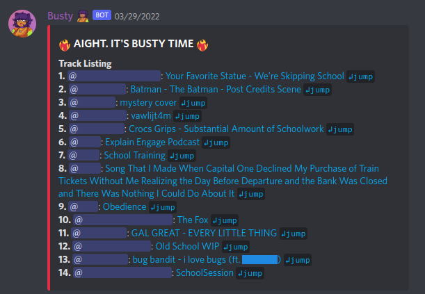
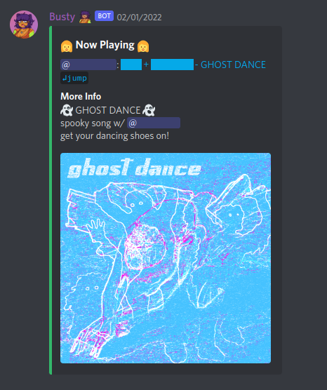

# Busty

Busty is a bot for showcasing entries for music competitions hosted on Discord. Users 
can submit audio to a channel as file attachments. The bot can then list and queue all 
submitted audio, then play each media file sequentially in a Stage or Voice Call for all
to hear. These shows are known as "busts".

## Features

* Display all submitted media in a formatted list on command.
* Support for displaying embedded artist and title tags.
* Automatic pinning of track listing.
* Configurable cooldown period between each song.
* Display currently playing song as well as any text that was sent in the message.
* Display a random emoji per song. The list of emoji can be configured.
* Skip the currently playing song.
* Role-based permissions for using bot commands.

Please see the [issue list](https://github.com/anoadragon453/busty/issues) for planned 
features, or to suggest your own.

## Screenshots




## Install

You'll need at least Python 3.6 and [ffmpeg](https://ffmpeg.org/) installed.

Create a python virtual environment to install python dependencies in.

```
python3 -m venv env
source env/bin/activate
```

And install the dependencies:

```
pip install -r requirements.txt
```

To install an additional set of python dependencies for speeding up the bot, install the
`nextcord[speed]` package as well.You may need to install additional system packages.

## Configure

You'll need to create a Discord app, and add a bot component. **Ensure the bot has the
"Server Members Intent" and "Message Content Intent"** options enabled, otherwise the bot
will not function correctly. Note that this will limit your bot to participating in 100
servers maximum, unless you verify your bot with Discord.

Copy the bot token, and ensure that the environment variable `BUSTY_DISCORD_TOKEN` contains
the bot token when running the bot.

If you'd like automatic Google Form generation, you need a [Google service account](https://cloud.google.com/iam/docs/service-accounts).
You must also ensure a Google service account key file is pointed to by `BUSTY_GOOGLE_AUTH_FILE`,
and that `BUSTY_GOOGLE_FORM_FOLDER` contains a valid Google Drive folder ID accessible by your service account.
To find the ID of a Google Drive folder, navigate inside it in your web browser. The folder ID is the token at the end of the URL.

Finally, add the bot to your desired Discord server.

The complete list of environment variable configuration options is:
1. `BUSTY_DISCORD_TOKEN` - Discord bot API token (required)
1. `BUSTY_GOOGLE_FORM_FOLDER` - Google Drive folder ID for voting form (required for form generation)
1. `BUSTY_GOOGLE_AUTH_FILE` - Google service account auth file (default = auth/service_key.json)
1. `BUSTY_COOLDOWN_SECS` - Number of seconds between songs (default = 10)
1. `BUSTY_ATTACHMENT_DIR` - Directory to save attachments (default = attachments)
1. `BUSTY_DJ_ROLE` - Name of role with permissions to run commands (default = bangermeister)
1. `BUSTY_CUSTOM_EMOJI_FILEPATH` - The Python module to import containing the emoji list (default = emoji_list)

A random emoji is displayed for each song played during a bust. The list of possible
emoji is defined in [emoji_list.py](src/emoji_list.py). If you would like to customize
this list, simply copy the file, edit it, and set `BUSTY_CUSTOM_EMOJI_FILEPATH` to
the import path (often simply the filename without an extension) of the new module.

## Run

With the proper environment variables set, start the bot with:

```
python src/main.py
```

It should connect to Discord and display the currently logged-in application name.

## Usage

The expected flow for running a bust is:

* Users submit songs into a channel.
* All users join a voice channel or stage.
* An admin runs `!list` to list all submitted songs and the order they will be played in.
* An admin runs `!bust` to start the show. The bot will join the channel and begin playing songs in the order they were submitted.
* Users comment on songs while they play.
* An admin can run `!skip` at any time to skip the current song, or `!stop` to manually stop the show.
* Once the last song has played, the bot will post a concluding message and leave the call.

### Command Reference

1. `!list [<channel>] [full]` - Download and list all media sent in the current text channel. Specifying a channel will cause songs to be pulled from that channel instead. This must be run before `!bust`. 
If the `full` flag is set or if the channel listed is the channel the command was sent in, list messages are pinned and a Google Form for voting is generated.
1. `!bust [<song #>]` - Join the vc/stage that the user who ran this command is currently in, and plays the tracks in the channel in order. The user must be in a vc or stage for this to work. Specifying a song index will skip to that index before playing.
1. `!image [<url>]` - Queue an image to be used in the Google Form generated when running `!list`. Run `!image` with no arguments for full usage information.
1. `!skip` - Skips the current track :scream: 
1. `!stop` - Stop busting early :scream: :scream: :scream: 

Users must have the `bangermeister` role to use commands by default, though this role can
be modified by passing the `BUSTY_DJ_ROLE` environment variable.

## Development

If you'd like to help Busty in her quest, consider working on one of the
[currently open issues](https://github.com/anoadragon453/busty). Before you do,
please double-check that a pull request for the issue
[does not already exist](https://github.com/anoadragon453/busty/pulls).

### Installing the development dependencies

Some extra Python modules are necessary when developing for Busty. These are
contained in the `dev-requirements.txt` file. To install them, run:

```shell
# Activate the virtualenv if not already done so
source env/bin/activate

# Install development dependencies
pip install -r dev-requirements.txt
```

### Testing your changes

Busty does not currently feature any automated testing. Testing is carried out
manually, typically in one's own test Discord guild.

Once you have implemented your change, please ensure that [known commands](#command-reference),
listing tracks and playing songs all work with your change. Pull requests are
additionally tested by reviewers before merging them, but we're only human.

### Linting

Once you have implemented your feature and tested that it works, you'll need to
ensure your code is properly formatted. Running `./scripts-dev/lint.sh` will
check this for you and - in most cases - fix any style issues automatically.

Otherwise, some issues may need to be fixed manually. These will be printed when
`lint.sh` is run. They must be fixed before your PR will be accepted. If you
are unable to figure out how to appease the linter, simply post and mark your
pull request as a draft and ask for help in a comment.
