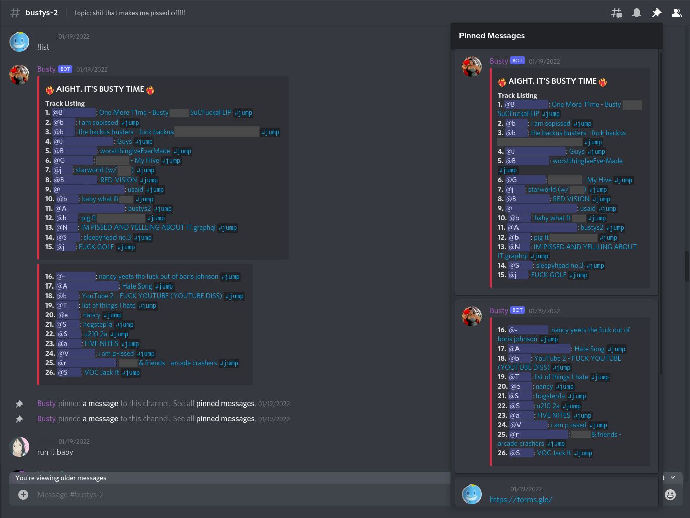
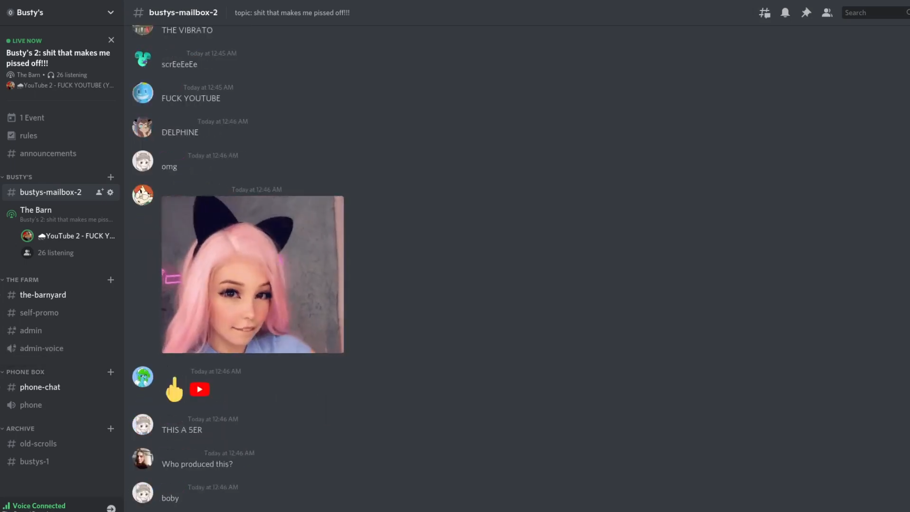

# Busty

Busty is a bot for showcasing entries for music competitions hosted on Discord. Users 
can submit audio to a channel as file attachments. The bot can then list and queue all 
submitted audio, then play each media file sequentially in a Stage or Voice Call for all
to hear. These shows are known as "busts".

## Features

* Display all submitted media in a formatted list on command.
* Support for displaying embedded artist and title tags.
* Automatic pinning of track listing.
* Configurable cooldown period between each song.
* Display currently playing song as well as any text that was sent in the message.
* Display a random emoji per song. The list of emoji can be configured.
* Skip the currently playing song.
* Role-based permissions for using bot commands.

Please see the [issue list](https://github.com/anoadragon453/busty/issues) for planned 
features, or to suggest your own.

## Screenshots




## Install

You'll need at least Python 3.6 and [ffmpeg](https://ffmpeg.org/) installed.

Create a python virtual environment to install python dependencies in.

```
python3 -m venv env
source env/bin/activate
```

And install the dependencies:

```
pip install -r requirements.txt
```

To install additional packages for speedup, install the `nextcord[speed]` package as well.

## Configure

You'll need to create a Discord app, add a bot component, and copy the bot token.
Ensure that the environment variable `BUSTY_DISCORD_TOKEN` contains the bot token when running the bot.
Then, add the bot to your desired Discord server.

The complete list of environment variable configuration options is
1. `BUSTY_DISCORD_TOKEN` - Discord bot API token (required)
2. `BUSTY_COOLDOWN_SECS` - Number of seconds between songs (default = 10)
3. `BUSTY_ATTACHMENT_DIR` - Directory to save attachments (default = attachments)
4. `BUSTY_DJ_ROLE` - Name of role with permissions to run commands (default = bangermeister)

## Run

With the proper environment variables set, start the bot with:

```
python main.py
```

It should connect to Discord and display the currently logged-in application name.

## Usage

The expected flow for running a bust is:

* Users submit songs into a channel.
* All users join a voice channel or stage.
* An admin runs `!list` to list all submitted songs and the order they will be played in.
* An admin runs `!bust` to start the show. The bot will join the channel and begin playing songs in the order they were submitted.
* Users comment on songs while they play.
* An admin can run `!skip` at any time to skip the current song, or `!stop` to manually stop the show.
* Once the last song has played, the bot will post a concluding message and leave the call.

### Command Reference

1. `!list` - Download and list all media files in the text channel this is used in. This needs to be run before `!bust` can be.
1. `!bust [<song #>]` - Join the vc/stage that the user who ran this command is currently in, and plays the tracks in the channel in order. The user must be in a vc or stage for this to work. Specifying a song index will skip to that index before playing.
1. `!skip` - Skips the current track :scream: 
1. `!stop` - Stop busting early :scream: :scream: :scream: 

Users must have the `bangermeister` role to use commands by default, though this role can
be modified by passing the `BUSTY_DJ_ROLE` environment variable.
